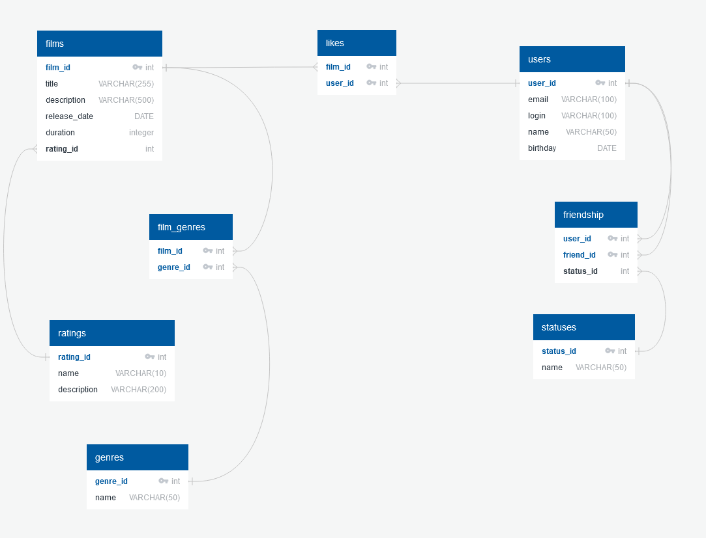

# java-filmorate
Repository for Filmorate project.

SELECT title 
FROM film 
WHERE EXTRACT(YEAR FROM release_date)=2009; 
 
SELET COUNT(user_id) AS likes_count 
FROM like 
WHERE film_id=2; 
 
SELECT film_id,COUNT(user_id) AS likes_count 
FROM like  
GROUP BY film_id 
ORDER BY likes_count DESC 
LIMIT 10;   
 
SELECT  g.name AS genres 
FROM film_genres AS fm 
JOIN films AS f ON fm.film_id=f.film_id 
JOIN genres AS g ON fm.genre_id=g.genre_id  
WHERE f.film_id=1 
GROUP BY g.name; 
 
SELECT f.title AS film_title  
FROM likes AS l 
JOIN films AS f ON l.film_id=f.film_id 
JOIN users AS u ON l.user_id=u.user_id 
WHERE l.user_id=1 
GROUP BY film_title; 

