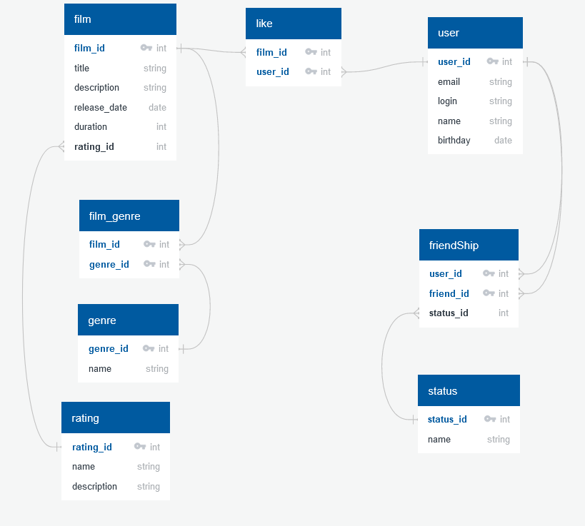

# java-filmorate
Repository for Filmorate project.

SELECT title 
FROM film
WHERE EXTRACT(YEAR FROM release_date)=2009;

SELET COUNT(user_id) AS likes_count 
FROM like
WHERE film_id=2;

SELECT film_id,COUNT(user_id) AS likes_count 
FROM like 
GROUP BY film_id 
ORDER BY likes_count DESC
LIMIT 10;  

